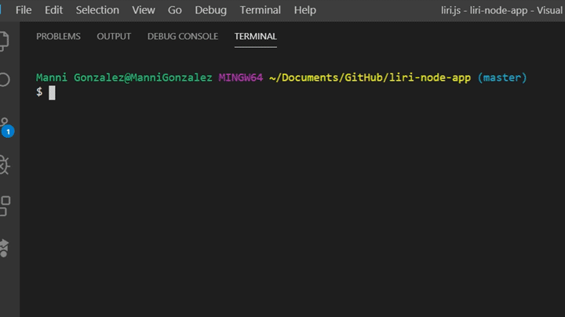
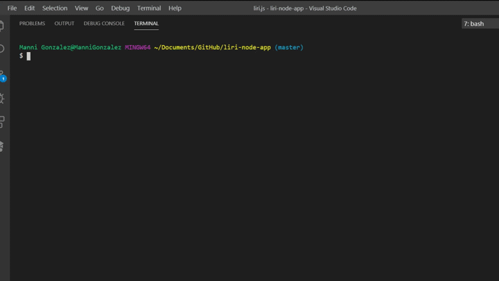
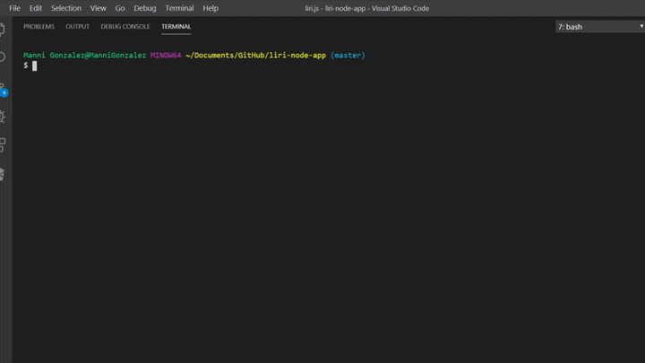
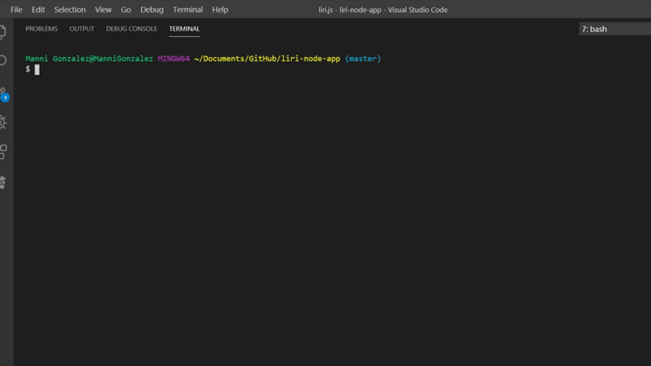

# LIRI NODE APP

**LIRI = Language Interpretation and Recognition Interface.**  
LIRI is a command line node app that takes in parameters and gives you back data.

## User commands

> #### concert-this
>
> - This command uses the bands in town API to search for the users entered Band/Artist.

> #### spotify-this-song
>
> - This command uses the Spotify API to search for the users Song Name.
> - If no song name is entered it will return results for "The Sign" by Ace of Base.

> #### movie-this
>
> - This command uses the OMDB API to search for the users Movie Name.
> - If no movie name is entered it will return results for "Mr. Nobody."

> #### do-what-it-says
>
> - This command uses the File-system package to read an external text file and return a result based on its contents.

##Working Examples Below:##

**node liri concert-this Tool**

**node liri spotify-this-song Set You Free**

**node liri movie-this The Big Lebowski**

**node liri do-what-it-says**

## Built With

- Visual Studio Code - Text editor
- JavaScript - Script language
- Node.js - Runtime environment
- JSON - Data format
- API's - Bandsintown, OMDB & Spotify
- Packages - axios, dotenv, File-system, Moment
