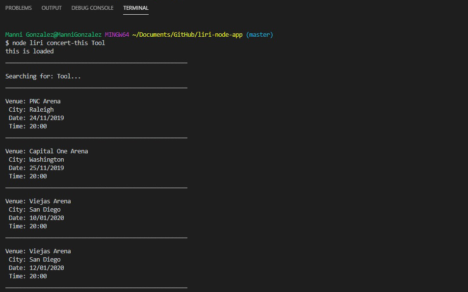
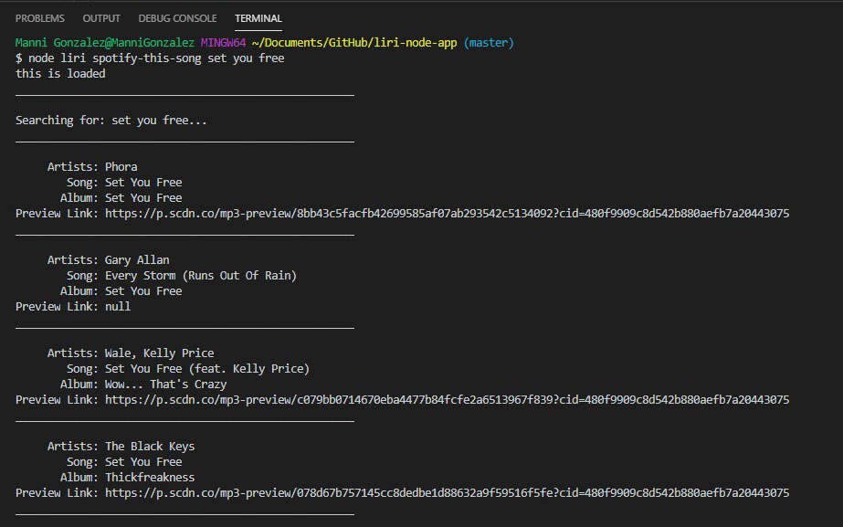
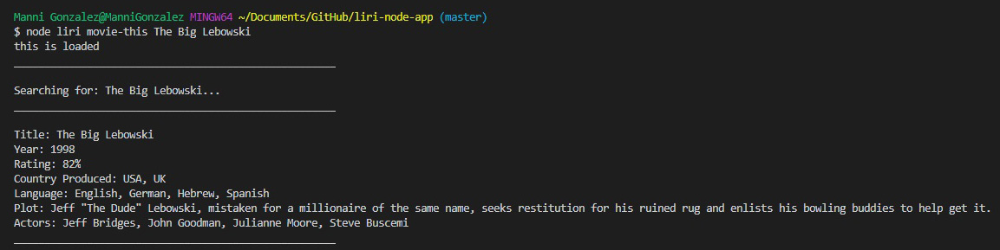
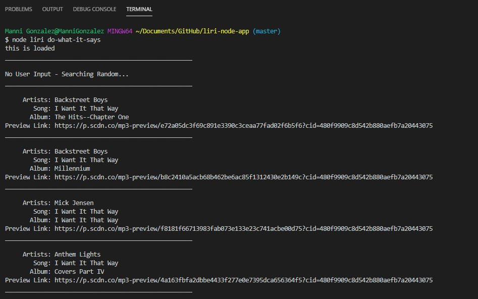

# LIRI NODE APP

LIRI is like iPhone's SIRI. However, while SIRI is a Speech Interpretation and Recognition Interface, LIRI is a Language Interpretation and Recognition Interface.

LIRI is a command line node app that takes in parameters and gives you back data

## User commands

- concert-this
- spotify-this-song
- movie-this
- do-what-it-says

**To use LIRI type the following into the terminal;**
node liri (command) (band/artist, song or movie)

**Example:**
node liri movie-this The Matrix

**node liri concert-this Tool**

**node liri spotify-this-song Set You Free**

**node liri movie-this The Big Lebowski**

**node liri do-what-it-says**

# Built With

- Visual Studio Code - Text editor
- JavaScript - Script language
- Node.js - Runtime environment
- JSON - Data format
- Bandsintown API - for concerts
- Spotify API - for music
- OMDB API - for movies
